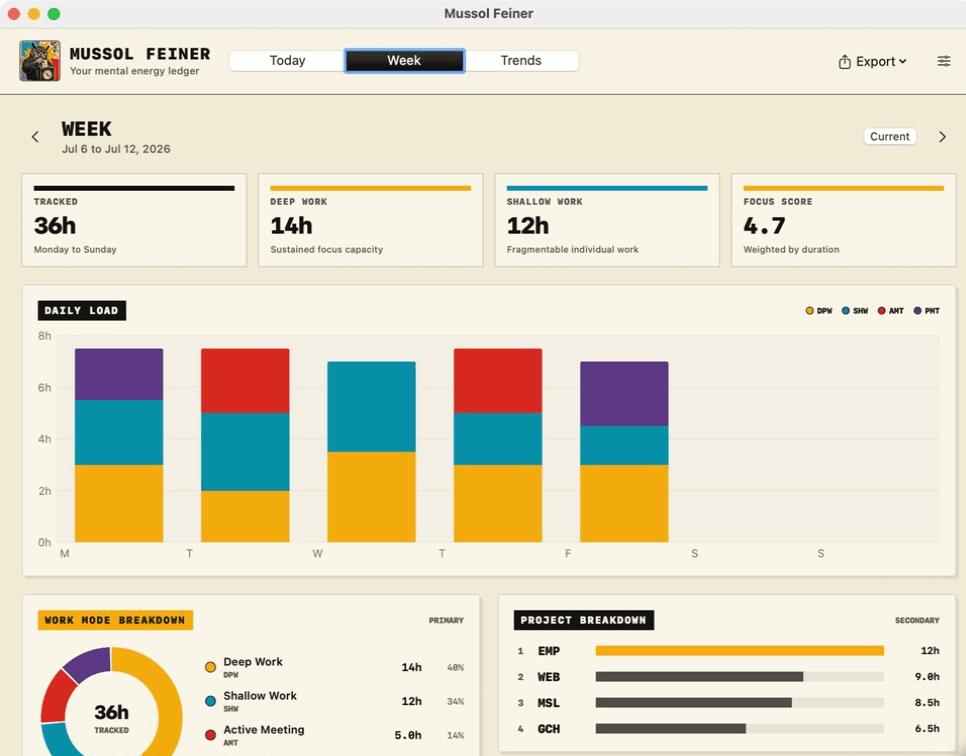
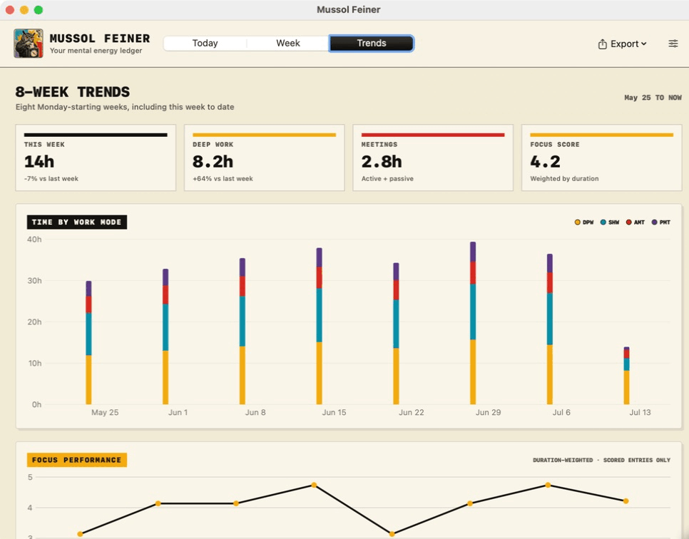
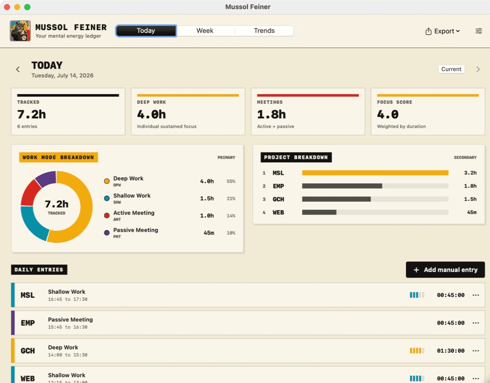

<p align="center">
  
</p>

# Mussol Feiner

Mussol Feiner is a private, local-first macOS time tracker for understanding how your working energy is spent.

The menu bar stays intentionally compact:

```text
● ABC 01:24:08
```

`ABC` is a free-form three-letter project code. The colored dot identifies the work mode:

- Deep Work
- Shallow Work
- Active Meeting
- Passive Meeting

There is no project catalogue to maintain. Repeated codes are grouped automatically, and entries can be edited later to normalize them.

## Screenshots

### Weekly energy

Daily load, work-mode capacity, and automatic project grouping.



### Eight-week trends

Time by work mode alongside duration-weighted Focus Score.



### Today

Color-coded entries, work-mode mix, and project totals at a glance.



<sub>Screenshots use synthetic data.</sub>

## MVP

- One active timer at a time
- Start and stop from the menu bar popover or the analytics window
- Editable elapsed time: backdate a start when work began before clocking in, or correct a running timer in place (`45m`, `1h 30m`, `01:30:00`)
- Local JSON persistence with active-timer recovery
- Optional 1 to 5 Focus Score when stopping
- Manual entry creation and editing
- Today and Monday-to-Sunday week views
- Eight-week trends
- Duration-weighted focus analytics
- Work-mode breakdown first, project breakdown second
- JSON, CSV, and Markdown export
- Custom colors for each work mode
- No account, cloud sync, or idle detection

## Status

MVP Universal 2 for macOS 13 or newer. Local bundles are ad hoc signed and are not notarized by Apple. This repository currently publishes source code only.

## Requirements

- macOS 13 or newer
- Swift 5.8 or newer

## Develop

```bash
./scripts/test.sh
```

`test.sh` runs the XCTest suite when full Xcode platform metadata is available. On a Command Line Tools-only machine, it runs the equivalent direct core harness instead.

`swift run mussol-feiner` is also available on machines with full Xcode platform metadata. Command Line Tools-only machines should use the app-bundle script below.

## Build the app bundle

```bash
./scripts/build-app.sh
```

The local build for the current Mac architecture is written to `dist/Mussol Feiner.app`.

To build a Universal 2 bundle:

```bash
MUSSOL_ARCHES="arm64 x86_64" ./scripts/build-app.sh
```

## Install locally

```bash
./scripts/install-app.sh
```

This installs the app at `/Applications/Mussol Feiner.app`.

## Data

Mussol Feiner stores its local state under:

```text
~/Library/Application Support/Mussol Feiner/
```

Exports are user-selected and never uploaded.
